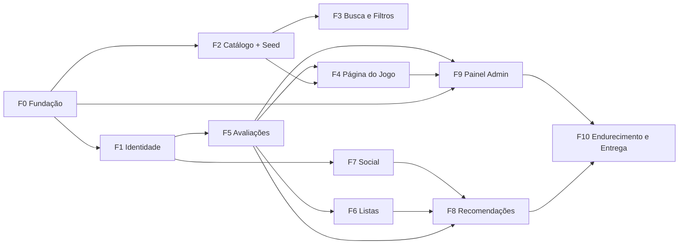

# Plano de implementação — GameLog

Fonte: `SPEC/2026-10-01-visao-geral.md` (visão geral + 9 specs de parte).
Última atualização: 2026-10-01.

> **Bloqueio conhecido:** a spec-mãe referencia 9 arquivos em `SPEC/` que ainda **não existem** no repositório
> (`cadastro-e-login.md`, `catalogo.md`, `busca-e-filtros.md`, `pagina-do-jogo.md`, `avaliacoes.md`, `listas.md`,
> `social.md`, `recomendacoes.md`, `painel-admin.md`). As tarefas abaixo derivam dos critérios **globais** e das
> regras de domínio; cada spec detalhada deve ser lida e reconciliada na tarefa **T-00**.


---

## 1. Stack

Decisão **D-01**: Python + Flask (a máquina tem Node.js, mas o projeto é Python).

| Camada | Escolha | Motivo / critério atendido |
|---|---|---|
| Linguagem | Python 3.12 (`/usr/bin/python3`) | disponível na máquina; sem build step |
| Web | Flask + Blueprints (app factory `create_app`) | um blueprint por parte do sistema (spec) |
| Templates | Jinja2 server-side + CSS próprio em `src/static/` | GLOBAL-01 (URL pública), sem CDN/serviço externo |
| Banco | SQLite (arquivo local) + SQLAlchemy 2.x | testes locais sem serviço externo (RNF) |
| Migrações | Alembic / `flask db` (ou criação de schema idempotente no bootstrap) | reprodutibilidade do seed |
| Autenticação | Sessão Flask (cookie assinado) + `werkzeug.security` (scrypt/pbkdf2) | GLOBAL-06 (nunca texto puro) |
| Formulários/validação | Flask-WTF + WTForms, CSRF habilitado | GLOBAL-03 (validação no servidor) |
| Paginação | helper único `paginate(query, page, per_page=20)` | GLOBAL-04 |
| Seed | CLI `flask seed` com `random.Random(SEED_FIXA)` | GLOBAL-07 (fictício e reproduzível) |
| Testes | pytest + fixtures de app/client; `tmp_path` para o SQLite | GLOBAL-08 (1+ teste por AC) |
| Qualidade | ruff + black (opcional, não bloqueia) | — |
| Config | variáveis de ambiente (`SECRET_KEY`, `DATABASE_URL`, `FLASK_ENV`) via `.env` (não versionado) | Restrição "sem segredos no repo" |
| Capas | SVG/CSS geradas a partir de hash do título | Restrição de direitos autorais |

**Fora de escopo** (não implementar): jogos jogáveis, compra/venda/pagamentos, chat em tempo real, app mobile,
integração Steam, upload de imagens de usuário.

### 1.1 Estrutura de pastas alvo

```
src/
  app/
    __init__.py            # create_app(), registro de blueprints, error handlers
    config.py              # leitura de env vars + defaults de teste
    extensions.py          # db, csrf, login_manager
    models/                # usuario, jogo, genero, plataforma, desenvolvedora,
                           # avaliacao, curtida, denuncia, lista, seguidor, atividade
    blueprints/
      auth.py              # cadastro-e-login
      catalogo.py          # catalogo
      busca.py             # busca-e-filtros
      jogo.py              # pagina-do-jogo
      avaliacoes.py        # avaliacoes
      listas.py            # listas
      social.py            # social
      recomendacoes.py     # recomendacoes
      admin.py             # painel-admin
    templates/             # base.html + um diretório por blueprint
    static/css/            # layout responsivo (desktop + mobile)
    cli.py                 # comandos: seed, reset-db
  run.py                   # ponto de entrada de dev (127.0.0.1:5000)
tests/
  conftest.py              # app/client/db/seed fixtures
  test_<spec>.py           # um arquivo por spec
```

---

## 2. Ordem de implementação

Ordem por **dependência de dados**: nada que dependa de usuário vem antes de identidade; nada que dependa de
jogo vem antes do catálogo.



| Ordem | Fase | Spec de origem | Depende de |
|---|---|---|---|
| 1 | F0 Fundação | visão geral (RNF, restrições) | — |
| 2 | F1 Identidade | `cadastro-e-login` | F0 |
| 3 | F2 Catálogo + seed | `catalogo`, `busca-e-filtros` (dados) | F0 |
| 4 | F3 Busca e filtros | `busca-e-filtros` | F2 |
| 5 | F4 Página do jogo | `pagina-do-jogo` | F2, F5 |
| 6 | F5 Avaliações | `avaliacoes` | F1, F2 |
| 7 | F6 Listas | `listas` | F1, F2, F5 |
| 8 | F7 Social | `social` | F1 |
| 9 | F8 Recomendações | `recomendacoes` | F5, F6, F7 |
| 10 | F9 Painel admin | `painel-admin` | F2, F4, F5 |
| 11 | F10 Endurecimento | critérios globais | todas |

> Nota: F4 (página do jogo) depende de F5 (avaliações) para exibir nota média; implementar F4 com um bloco de
> média placeholder e ligar em F5, ou inverter F4/F5 se preferir a média já real.

---

## 3. Tarefas

Legenda de estado: `[ ]` pendente · `[~]` em andamento · `[x]` concluída.

### T-00 — Reconciliar specs detalhadas
- [ ] Ler os 9 arquivos de `SPEC/*.md` (quando existirem) e extrair os critérios de aceitação de cada parte.
- [ ] Atualizar a coluna "Critérios" das fases abaixo com os IDs reais (`AUTH-xx`, `CAT-xx`, …).
- [ ] Sinalizar conflitos entre a visão geral e as specs de parte.

### F0 — Fundação (T-01..T-06)
- [ ] **T-01** `create_app()` com app factory, leitura de config por env var e `.env.example` versionado.
- [ ] **T-02** Modelos base + criação de schema; `db` e `csrf` como extensões.
- [ ] **T-03** `base.html` + layout responsivo (desktop e mobile) + CSS próprio. *(RNF navegadores/mobile)*
- [ ] **T-04** Helper de paginação `20/página` e macro de paginação no template. *(GLOBAL-04)*
- [ ] **T-05** Tratamento global de erros (403/404/500) sem vazar segredos + flash messages. *(RNF erro seguro)*
- [ ] **T-06** CLI `flask seed` e `flask reset-db`, com seed fixa e idempotente. *(GLOBAL-07)*
- [ ] **T-07** `conftest.py` com fixtures `app`, `client`, `db`, `seed` e 1 teste de fumaça da home. *(GLOBAL-08)*

### F1 — Identidade (spec `cadastro-e-login`)
- [ ] **T-10** Modelo `Usuario` (nome, email único, hash de senha, papel `jogador|admin`), sem senha em texto. *(GLOBAL-06)*
- [ ] **T-11** Cadastro com validação server-side e mensagens claras. *(GLOBAL-03)*
- [ ] **T-12** Login/logout com sessão Flask e `next` para retorno à ação. *(GLOBAL-02)*
- [ ] **T-13** Perfil público/privado e edição de dados básicos (avatar por iniciais/cor gerada).
- [ ] **T-14** Decorator `login_required` + `admin_required` reutilizáveis. *(GLOBAL-02, GLOBAL-05)*
- [ ] **T-15** Testes: cadastro válido/ inválido, email duplicado, login, logout, redirect com `next`. *(GLOBAL-02/03/06)*

### F2 — Catálogo + seed (spec `catalogo`)
- [ ] **T-20** Modelos `Jogo`, `Genero`, `Plataforma`, `Desenvolvedora` com N:N (jogo↔gênero, jogo↔plataforma).
- [ ] **T-21** Soft delete de jogo (`removido_em`) — some da busca pública, mantém histórico. *(Regras de domínio)*
- [ ] **T-22** Seed fictício: ~100 jogos, gêneros, plataformas, desenvolvedoras, capas SVG geradas. *(GLOBAL-07 + restrição)*
- [ ] **T-23** Listagem de catálogo paginada + filtro por gênero/plataforma/desenvolvedora. *(GLOBAL-04)*
- [ ] **T-24** Testes: seed reproduzível (2 execuções = mesmos dados), jogos removidos fora da busca, N:N. *(GLOBAL-07)*

### F3 — Busca e filtros (spec `busca-e-filtros`)
- [ ] **T-30** Busca por texto (título) com `LIKE`/FTS e normalização (case/acentos).
- [ ] **T-31** Filtros combinados (gênero + plataforma + ano) e ordenação (título, nota, data, popularidade).
- [ ] **T-32** Paginação preservando querystring dos filtros. *(GLOBAL-04)*
- [ ] **T-33** Estado vazio e mensagem quando nada é encontrado.
- [ ] **T-34** Testes: busca, filtro combinado, ordenação, paginação com filtros.

### F4 — Página do jogo (spec `pagina-do-jogo`)
- [ ] **T-40** Rota `/jogos/<slug>` com dados, plataformas, gêneros, desenvolvedora e capa.
- [ ] **T-41** Nota média (inteira 0–10) e contagem de avaliações. *(Regras de domínio)*
- [ ] **T-42** Lista de resenhas paginada + resumo de notas (distribuição).
- [ ] **T-43** Jogos relacionados (mesmo gênero, maiores notas).
- [ ] **T-44** SEO básico (title/description/OG) e 404 para jogo removido/inexistente.
- [ ] **T-45** Testes: média correta, relacionados, 404, resenhas paginadas.

### F5 — Avaliações (spec `avaliacoes`)
- [ ] **T-50** Modelo `Avaliacao` com unique `(usuario_id, jogo_id)` — 1 avaliação por usuário por jogo.
- [ ] **T-51** Nota obrigatória inteira 0–10; resenha opcional. *(Regras de domínio)*
- [ ] **T-52** Criar/editar/remover a própria avaliação (autorização do dono).
- [ ] **T-53** Curtir/descurtir avaliação (1 por usuário, idempotente).
- [ ] **T-54** Denunciar avaliação; conteúdo denunciado pode ser ocultado por admin. *(Regras de domínio)*
- [ ] **T-55** Registrar atividade no feed a cada avaliação/listas/seguir. *(prepara F7)*
- [ ] **T-56** Testes: unicidade, nota fora do intervalo, resenha vazia com nota, curtida duplicada, denúncia, ocultação.

### F6 — Listas e status (spec `listas`)
- [ ] **T-60** Status do jogo por usuário: `planejado | jogando | jogado | abandonado`. *(Regras de domínio)*
- [ ] **T-61** Modelos `Lista` (dono único) e `ListaJogo` (N:N jogo↔lista). *(Regras de domínio)*
- [ ] **T-62** CRUD de listas customizadas + adicionar/remover jogos de uma lista.
- [ ] **T-63** Página pública de lista (respeitando privacidade) e página "minhas listas".
- [ ] **T-64** Testes: lista pertence a 1 usuário, jogo em várias listas, status, autorização de edição.

### F7 — Social (spec `social`)
- [ ] **T-70** Modelo `Seguidor` (`seguidor_id`, `seguido_id`) com bloqueio de auto-seguir. *(Regras de domínio)*
- [ ] **T-71** Seguir/deixar de seguir + contadores de seguidores/seguindo.
- [ ] **T-72** Feed de atividade dos usuários seguidos, paginado. *(GLOBAL-04)*
- [ ] **T-73** Testes: não seguir a si mesmo, seguir/deseguir idempotente, feed só de seguidos e paginado.

### F8 — Recomendações (spec `recomendacoes`)
- [ ] **T-80** Sugestões por gêneros/plataformas do histórico do usuário, excluindo já jogados.
- [ ] **T-81** Fallback para "em alta" quando o histórico é vazio (visitante ou usuário novo).
- [ ] **T-82** Bloco de recomendações na home e na página do usuário.
- [ ] **T-83** Testes: exclusão de jogados, determinismo com seed, fallback sem histórico.

### F9 — Painel admin (spec `painel-admin`)
- [ ] **T-90** Área `/admin` restrita a `admin` — 403 para os demais. *(GLOBAL-05)*
- [ ] **T-91** CRUD de jogos (criar/editar/remover do catálogo via soft delete). *(Regras de domínio)*
- [ ] **T-92** CRUD de gêneros, plataformas e desenvolvedoras.
- [ ] **T-93** Moderação: fila de denúncias e ação de ocultar/restaurar conteúdo. *(Regras de domínio)*
- [ ] **T-94** Testes: 403 para não-admin, CRUD completo, moderação ocultando e restaurando.

### F10 — Endurecimento e entrega
- [ ] **T-100** Auditoria GLOBAL-01..GLOBAL-08 com tabela de rastreabilidade AC → teste.
- [ ] **T-101** Verificação de que nenhuma rota admin responde a não-admin e nenhum segredo está no repo. *(GLOBAL-05, restrição)*
- [ ] **T-102** Varredura de XSS/CSRF/injeção nos formulários e escape de resenhas.
- [ ] **T-103** Responsividade desktop/mobile validada no navegador em `127.0.0.1:5000`.
- [ ] **T-104** `README.md` com setup, `.env.example`, comando de seed e execução dos testes.
- [ ] **T-105** Suíte completa verde (`pytest`) sem dependência de serviços externos. *(RNF, GLOBAL-08)*

---

## 4. Matriz de rastreabilidade (global)

| Critério | Onde é atendido | Tarefas |
|---|---|---|
| GLOBAL-01 | home pública com destaques, sem login | T-03, T-23, T-82 |
| GLOBAL-02 | `login_required` + `next` | T-12, T-14 |
| GLOBAL-03 | WTForms + validação server-side | T-11, T-21, T-51, T-62, T-91 |
| GLOBAL-04 | helper `paginate` 20/página | T-04, T-23, T-32, T-42, T-72 |
| GLOBAL-05 | `admin_required` → 403 | T-14, T-90, T-101 |
| GLOBAL-06 | `werkzeug.security` (hash) | T-10, T-15 |
| GLOBAL-07 | `flask seed` com seed fixa | T-06, T-22, T-24 |
| GLOBAL-08 | pytest, 1+ teste por AC | T-07 e todos os `*-Testes` |

## 5. Definition of Done (por tarefa)
1. Código no blueprint/modelo correto, seguindo a estrutura da seção 1.1.
2. Validação de entrada no servidor com mensagem de erro clara.
3. Ao menos um teste automatizado cobrindo o caminho feliz e um de erro.
4. Sem segredo hardcoded; config por env var.
5. `pytest` verde e `ruff` sem erros novos.

## 6. Riscos
| Risco | Impacto | Mitigação |
|---|---|---|
| Specs de parte ausentes no repo | tarefas podem divergir dos AC reais | executar T-00 antes de F1+ |
| Média 0–10 com "nota inteira" | arredondamento ambíguo | decidir: média das notas, arredondada ao inteiro mais próximo (documentar) |
| Seed e testes em SQLite compartilhado | flakiness | banco em `tmp_path`, seed por fixture |
| F4 depende de F5 | ordem circular percebida | integrar média real ao final de F5 |
